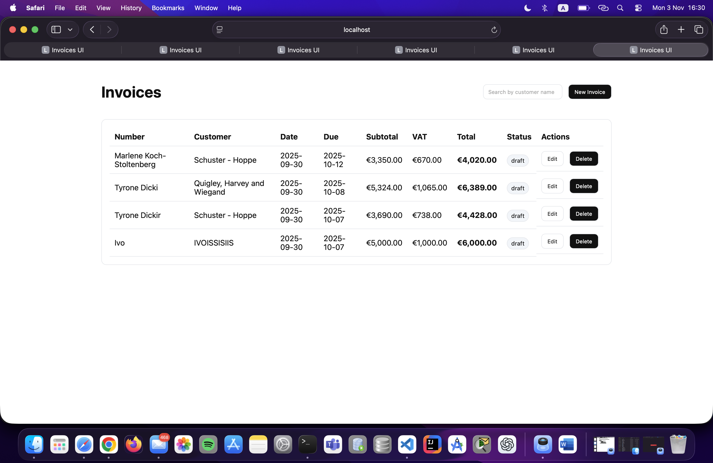

# 🧾 Invoices UI

A small invoicing UI built with **Vue 3 + TypeScript + Vite** as part of the Voidweb internship task.

## 🚀 Live Demo
🔗 [View on Vercel](https://invoices-ui-ten.vercel.app)

## ⚙️ Tech Stack
- Vue 3 + Composition API
- TypeScript
- Vite
- Axios
- Tailwind CSS (or custom styling)
- MockAPI backend (CRUD):  
  https://68da7d4b23ebc87faa304fad.mockapi.io/invoices

## 💻 Features
✅ Invoice list with search, loading, and delete confirmation  
✅ Invoice editor with validation and live preview  
✅ Client-side totals calculation (subtotal, VAT, total)  
✅ CRUD operations via API  
✅ Fully responsive, deploy-ready UI

## 🖼️ Preview

---

**Developed by:** Eniz Ali  
🌍 [Live App](https://invoices-ui-ten.vercel.app)

